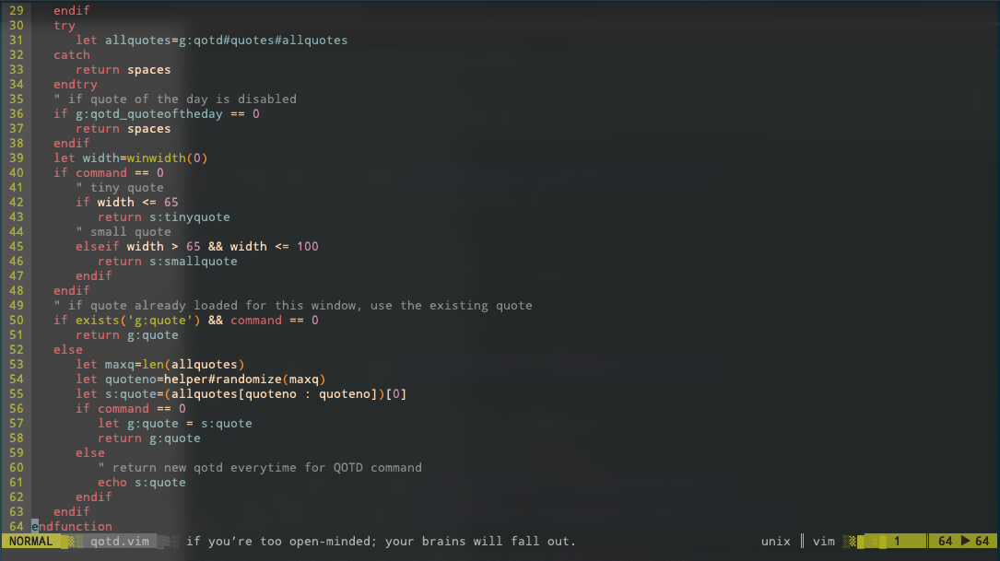

# vim-qotd
A simple plugin to get the quote of the day.

## Provides

1. Command - `:QOTD`
1. Function - `qotd#getquoteoftheday()`

## Configuration
You can integrate vim-qotd with other plugins like lightline or airline or add to 'statusline' directly.

To add to statusline, add something like below in your vimrc
```viml
set statusline=%{qotd#getquoteoftheday()}
```

### Screenshot




## Installation

You install vim-qotd like any other vim plugin.

##### Pathogen

```
cd ~/.vim/bundle
git clone https://github.com/ajatkj/vim-qotd.git
vim -u NONE -c "helptags vim-qotd/doc" -c q
```

##### VimPlug

Place this in your .vimrc:

```viml
Plug 'ajatkj/vim-qotd'
```

Then run the following in Vim:

```
:source %
:PlugInstall
```

##### No plugin manager

Copy vim-qotd's subdirectories into your vim configuration directory:

```
cd /tmp && git clone git://github.com/ajatkj/vim-qotd.git
cp -r vim-qotd/* ~/.vim/
```

See `:help add-global-plugin`.
